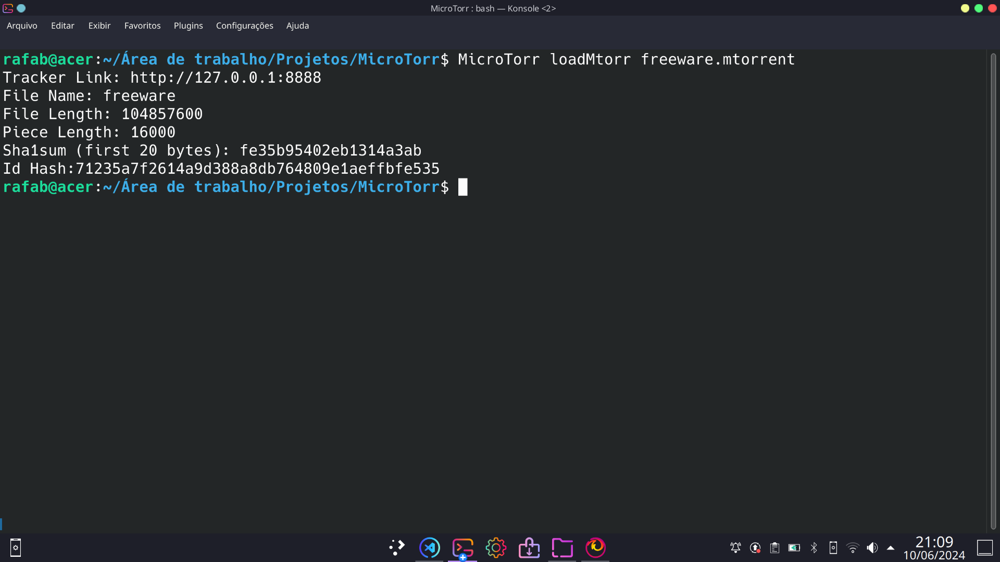

# MicroTorr: Peer to Peer file sharing inspired by BitTorrentV1


[Read this page in english](https://github.com/rafaelbarbeta/MicroTorr/blob/main/README.md)
## Sobre esse projeto
Implementação simplificada de uma rede de compartilhamento de arquivos peer to peer (P2P), inspirada no BitTorrent V1, escrita em Go. Vem com uma interface de linha de comando (CLI) feita com Cobra CLI.

Este projeto é capaz de executar uma simulação completa de um enxame mínimo de P2P, incluindo o servidor Tracker, o cliente torrent e a codificação de um arquivo para compartilhamento com este software. Ele implementa a maioria dos conceitos básicos do protocolo BitTorrent, tais como:

* Geração de arquivos de metadados ".torrent", com o algoritmo de codificação bencode
* Descoberta de peers com links de Tracker e timeouts
* Vários 'enxames' de torrent no mesmo tracker
* Estratégia de download "Rarest piece first"
* Mudança automática para modo de seeding uma vez que o download seja concluído
* Seleção de peers com base na estimativa de largura de banda e velocidade de conexão
* Verificação de integridade com o algoritmo de hash SHA1

Além disso, o MicroTorr inclui seus próprios recursos para facilitar a execução:
* Definição de velocidade máxima de upload e download
* Esperar por X quantidade de seeders e Y de leechers antes de começar o download
* Barra de progresso para o andamento do download
* Diferentes níveis (e cores) de verbosidade do programa
* Auto-completar comandos, fornecido pela Cobra CLI
  
## Dependências e Recursos Auxiliare
Este projeto é feito inteiramente em Go, e implementa a maioria das funcionalidades do BitTorrent "do zero". Aqui está uma lista dos módulos de terceiros usados na construção da aplicação:

1. [Cobra Cli](https://github.com/spf13/cobra)
2. [Bencode Encoding](https://github.com/jackpal/bencode-go)
3. [Bandwidth Limiting](https://github.com/conduitio/bwlimit)
4. [Progress Bar](https://github.com/schollz/progressbar)

Para referência, aqui está a especificação do [protocolo BitTorrent v1](https://wiki.theory.org/BitTorrentSpecification) que inspirou este projeto.
  
## Sobre a Implementação

Este código é composto por 3 partes diferentes: um gerador e carregador de metadados (.mtorrent), tracker e o cliente torrent. Aqui está uma breve explicação de cada parte.

### .mtorrent generator

```bash
MicroTorr createMtorr test_file # Creates a .mtorrent
MicroTorr loadMTorr # Shows .mtorrent info
```

Ele é responsável por gerar os metadados necessários para "dividir" um arquivo em pedaços e ajudar os peers a se conectarem. Usa bencode, assim como o BitTorrent, para codificar estes campos:

* announce: Contém a URL do tracker.
* info, que contém os valores: tamanho, nome do arquivo, tamanho dos pedaços, concatenação de sha1 dos pedaços, id_hash.

Exceto por id_hash, que é um sha1 do arquivo inteiro, todos os campos são os mesmos da estrutura de arquivo .torrent do BitTorrent.

### Tracker

```bash
MicroTorr tracker
```

Fornece apenas um endpoint: "GET /announce" com os parâmetros:
* info_hash: hash SHA-1 de 20 bytes do dicionário info do arquivo .mtorrent. Neste caso, é o id_hash.
* peer_id: ID de 20 bytes gerado aleatoriamente.
* ip: IP do peer.
* port: O número da porta na qual o peer está ouvindo.
* event: O tipo de evento. Pode ser "started", "stopped", "completed", "alive".

A resposta é um json que contém apenas os endereços IP dos peers, suas portas de escuta e IDs. Uma vez que um peer faz essa solicitação, ele é adicionado à lista de peers do enxame de info_hash.

Os peers no MicroTorr sempre se conectam a todos os outros peers disponíveis. Eles devem continuar enviando solicitações GET, com os mesmos parâmetros e evento "alive". Peers que não enviam uma solicitação GET em um intervalo de 30 segundos serão considerados mortos e removidos da lista de peers.

Eles também podem alertar o tracker sobre uma saída voluntária, com "completed" quando tiverem todas as peças, e "stopped" quando o download for cancelado pelo usuário (enviando um sinal de interrupção).

### Cliente Torrent

```bash
MicroTorr download test_file.mtorrent # Leech mode or download
MicroTorr download test_file.mtorrent -s test_file # Seed mode or upload
```

Responsável por baixar peças de outros peers para obter o arquivo solicitado. Os peers podem se conectar ao enxame tanto em modo leech quanto em modo seed, sendo que o último tem o arquivo completo carregado e dividido na memória. Isso é composto por três componentes principais: core, peerWire e trackerController.

#### Tracker Controller

Envia o "keep alive" para o tracker. Também se comunica com o componente Core para informar o Tracker sobre o status "completed" ou "stopped".

Fornece uma maneira de recuperar dados do tracker.

#### Peer Wire

Responsável por gerenciar sockets brutos, conexões TCP, limitações de largura de banda, conectar novos peers, desconectar peers, serializar mensagens e enviar e receber dados. Ele é executado em uma goroutine separada e serve como uma abstração para o componente "core", permitindo que o core envie dados estruturados em um canal, com um peerId como destino, e receba uma resposta em outro canal. Todo o processo de lidar com a rede subjacente é ocultado por este componente.

Também realiza o handshake inicial para cada nova conexão e gera uma mensagem de controle para o core com o novo peerId a ser adicionado.

#### Core

Executa a lógica central do programa, como determinar qual peça baixar, lidar com as atualizações dos peers e suas próprias atualizações, além de enviar e receber peças.

No total, há 4 tipos de mensagens que este protocolo pode enviar:

* have: Anuncia aos outros peers uma nova peça baixada.
* bitfield: Indica todas as peças que um peer possui ou não. É enviado sempre que uma nova conexão é feita e apenas uma vez pelo proprietário.
* request: Usado para solicitar um bloco.
* piece: O bloco real da peça.
Request e Piece são tratados por duas goroutines separadas, chamadas PieceRequester e PieceUploader, respectivamente.

PieceRequester solicitará continuamente peças no canal com o componente Peer Wire, seguindo a estratégia de "rarest piece first". Um contador ocorre para determinar qual peça (ou peças) tem o mínimo de peers que as possuem. Uma vez encontradas essas peças, o PieceRequester escolherá aleatoriamente uma peça entre todas as peças raras e escolherá um peer que possui essa peça e também é o peer mais rápido conhecido.

Este último passo acontece cerca de 90% das vezes, e nos 10% restantes, ele escolhe um peer aleatório.

Isso é para, esperançosamente, escolher um peer que seja mais rápido do que o esperado, já que a velocidade dos peers só é medida quando uma peça é baixada. Uma vez selecionada, a peça é solicitada e o PieceRequester aguarda sua chegada.

No outro extremo, uma goroutine PieceUploader atenderá a essa solicitação e sempre enviará a peça. Uma verificação de integridade SHA1 é feita para garantir que a peça é igual à esperada.

Quando todas as peças chegam, o PieceRequester chamará AssemblePieces para gravar o arquivo completo no disco e alerta o Tracker Controller de que o download foi concluído.

## Instalação

### Instalar a partir do código-fonte

Para instalar a partir do código-fonte, você precisará do compilador Go. Você pode seguir os passos da documentação oficial: [Go Download and install](https://go.dev/doc/install)

Em seguida, clone o repositório, instale o binário e adicione o script de autocomplete ao seu shell preferido. Supondo que você use o shell bash, estes são os comandos necessários para configurar o MicroTorr:

```bash
git clone https://github.com/rafaelbarbeta/MicroTorr
cd MicroTorr
go install 
MicroTorr completion bash > microtorr # Check your PATH variable if this fails!
sudo cp microtorr /etc/bash_completion.d/microtorr
```

Reinicie seu shell. Agora você pode executar o MicroTorr com autocompletar!

### Instalar com pacote debian (Recomendado)

Basta baixar o pacote .deb em "Releases" e executar:
```bash
sudo dpkg -i microtorr.deb
```
Isso colocará o binário em /usr/local/bin e também configurará o autocompletar no shell bash.

Sem necessidade de instalar Go ou qualquer outra coisa.

## Executando o MicroTorr

Let's build a simple torrent scenario to explore MicroTorr locally.
Vamos construir um cenário simples de torrent para explorar o MicroTorr localmente. Primeiro, vamos criar um arquivo de 100M com o comando dd chamado 'freeware':
```bash
dd if=/dev/urandom of=freeware bs=1M count=100
```
Em seguida, precisamos gerar um arquivo de metadados para freeware:
```bash
MicroTorr createMtorr freeware
MicroTorr loadMtorr freware.mtorrent # Checking if .mtorrent was created successfully
```
Uma vez que o arquivo de metadados seja criado, prosseguimos para criar um enxame contendo três peers: um "seeder" (que possui o arquivo completo) e dois "leechers" (que não possuem todos as peças). Eles se descobrirão com a ajuda de um Tracker:
```bash
MicroTorr tracker -v 2
```
O terminal ficará suspenso. Vamos abrir três novos terminais, um para o seeder e dois para os leechers.

Crie os diretórios "home" para peer1 e peer2:
```bash
mkdir -p peer/peer1
mkdir -p peer/peer2
```

Acesse cada um deles nos diferentes terminais. Inicie-os especificando o arquivo .mtorrent junto com o modo de verbosidade, interfaces loopback e portas de escuta.

Leecher 1
```bash
MicroTorr download ../../freeware.mtorrent -i lo -p 1111 -v 2
```

Leecher 2
```bash
MicroTorr download ../../freeware.mtorrent -i lo -p 2222 -v 2
```

Agora você verá que o tracker está recebendo solicitações "alive" de ambos os peers. Você pode perceber que nada aconteceu, exceto pelas mensagens "New Connection", porque eles estão esperando que pelo menos um seeder entre no enxame. Nesta demonstração, queremos limitar a largura de banda do seeder para 3 MB/s no máximo, então, cedo ou tarde, os leechers poderão cooperar para alcançar uma melhor velocidade de download.

No terminal do seeder, execute:
```bash
MicroTorr download freeware.mtorrent -i lo -p 3333 -v 2 -s freeware -u 3000
```

Agora observe a barra de progresso se preenchendo. Como você verá, a barra de progresso começa a se preencher lentamente e, com cerca de 50% do download, a velocidade aumenta rapidamente.

Nas estatísticas impressas, você pode ver que aproximadamente metade do arquivo foi baixado do seeder, e a outra metade foi baixada de outro peer. Isso acontece porque, seguindo a estratégia de download "rarest piece first", cada leecher baixa inicialmente um pedaço que o mínimo de peers atualmente possui no enxame. Isso leva a um comportamento interessante, onde cada leecher faz download de peças complementares. Depois disso, haverá um momento em que cada peça será de propriedade tanto do seeder quanto de um dos outros peers. Como o outro leecher agora também possui as peças restantes do arquivo, o leecher 1, por exemplo, pode tentar baixar uma peça do leecher 2. Ele notará que o leecher 2 tem uma velocidade de upload muito mais rápida do que o seeder, então ele fará o download das peças restantes dele. O inverso também é verdadeiro.

Se você quiser garantir que o arquivo recebido é realmente o mesmo que o do diretório raiz, basta executar este comando para o "freeware" em cada "diretório de peer":

```bash
sha1sum < freeware
```

Com sorte, a saída será a mesma para todos eles. E é isso!

Experimente com outros cenários também. Note que isso pode ser executado entre diferentes computadores na mesma LAN ou, se você tiver acesso a diferentes IPv4 públicos, pela internet!

## Limitações

Observe que este código não funciona como cliente BitTorrent, e portanto não pode baixar torrents da internet. Em vez disso, é uma simulação didática de como o protocolo funciona internamente. Eu o fiz como uma forma de me desafiar com programação concorrente, redes e, claro, a linguagem Go e seu ecossistema. Além disso, eu queria aprender como esse protocolo realmente funcionava, pois eu desconhecia completamente seu funcionamento interno até construir este código. Tenha em mente que alguns recursos do protocolo BitTorrent foram retirados desta implementação, tais como:

* Choking e Unchoking Oportunista
* Comportamento Tit-for-Tat (embora ele se comporte dessa forma, de certa maneira)
* Slots de Download e Upload
* Retransmissão de peças quebradas (detectadas por sha1)
* Técnicas de NAT traversal para peers sob NAT
* DHT (Tabela Hash Distribuída)
* Criptografia
* Links Magnet

E outros. 
Por essas razões, ele não é otimizado para baixar arquivos realmente grandes pela internet. Veja o [qbittorrent](https://github.com/qbittorrent/qBittorrent) para isso (use com responsabilidade! XD).


## Autor
* ([Rafael Barbeta](https://github.com/rafaelbarbeta))


## Screenshots




