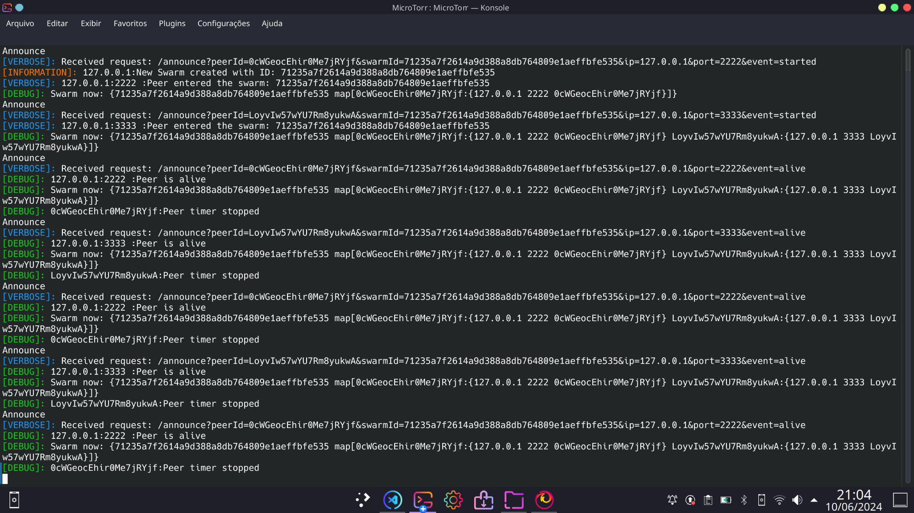
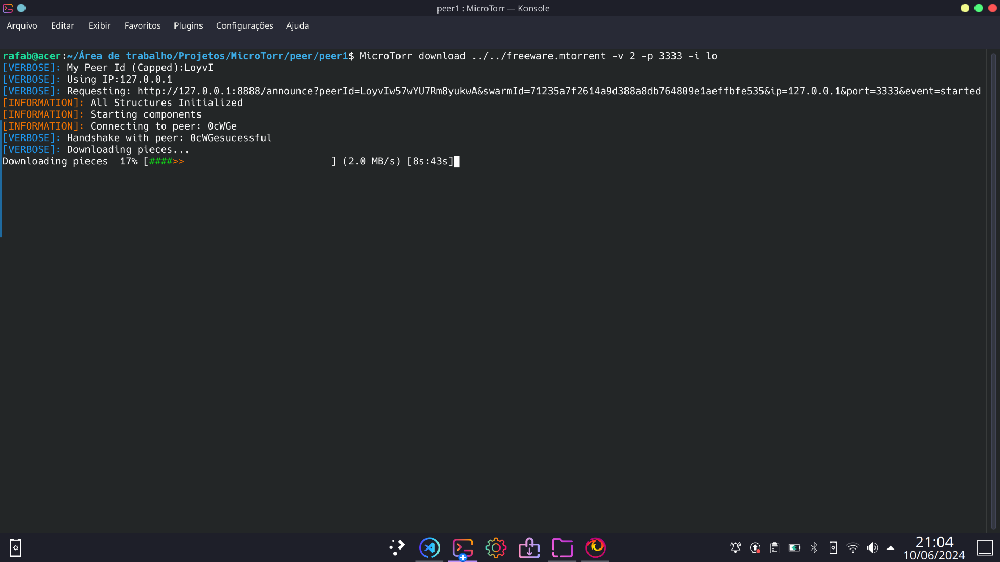

# MicroTorr: Peer to Peer file sharing inspired by BitTorrentV1


[Leia esta página em português](https://github.com/rafaelbarbeta/MicroTorr/blob/main/README-pt.md)
## About this project
Simplified implementation of a peer to peer (P2P) file sharing network, inspired by BitTorrent V1, written in Go language. Ships with a CLI interface made with Cobra CLI.

This project is capable of running a full simulation of a minimum P2P swarm, including the Tracker server, torrent client, and bencoding a file for sharing with this software. It does implements most of the basic concepts of the BitTorrent protocol, such as:

* Generation of ".torrent" metadata files, with the bencode encoding algorithm
* Peer discovery with Tracker links and timeouts
* Multiple torrent swarms on the same tracker
* "Rarest piece first" download strategy
* Automatic change to seeding mode once download is completed
* Peer selection based on estimated bandwidth and connection speed
* Integrity checking with SHA1 hashing algorithm

On top of that, MicroTorr includes its own features for easy of execution:
* Maximum uploading and downloading speed setting
* Wait for X amount of seeders and Y of leechers before downloading
* Progress Bar for download progress
* Different Levels (and colors) of program verbosity
* Command completion, provided by Cobra CLI
  
## Dependencies and Auxiliary resources
This project is made entirely in Go, and implements most BitTorrent features "from the ground up". Here is a list of third party modules used for building the application:

1. [Cobra Cli](https://github.com/spf13/cobra)
2. [Bencode Encoding](https://github.com/jackpal/bencode-go)
3. [Bandwidth Limiting](https://github.com/conduitio/bwlimit)
4. [Progress Bar](https://github.com/schollz/progressbar)

For reference, this is the specification of the [BitTorrent protocol v1](https://wiki.theory.org/BitTorrentSpecification) this project was inspired from.
  
## About the implementation

This code is composed of 3 different parts: a metadata (.mtorrent) generator and loader, tracker and the torrent client. Here is a brief explanation of each part

### .mtorrent generator

```bash
MicroTorr createMtorr test_file # Creates a .mtorrent
MicroTorr loadMTorr # Shows .mtorrent info
```

It is responsible to generate the metadata require for "dividing" a file into pieces and help peers connect to each other. It uses bencode, just like BitTorrent, to encode these fields:

* announce: Has the url of the tracker.
* info, which contains the values: length, file name, piece length, pieces sha1 concatenation, id_hash

Apart from id_hash, which is a sha1 of the whole file, all field are the same ones as the BitTorrent .torrent file structure.

### Tracker

```bash
MicroTorr tracker
```

Provides just one endpoint: "GET /annouce" with parameters:
* info_hash: 20-byte SHA-1 hash of the info dictionary from the .mtorrent file.
In this case, is id_hash.
* peer_id: 20 byte randomly generated id
* ip: peer ip
* port: The port number the peer is listening on.
* event: The event type. Ca be "started", "stopped", "completed", "alive".

The response is a json that contains only the peer's IP addresses, their listening ports, and ids. Once a peer makes this request, he is added to the peer list of the info_hash swarm.

Peers in MicroTorr will always connect to all other available peers.
Peers are supposed to continue sending GET requests, with the same parameters and event "alive". Peers that do not send a GET request within a time span of 30 seconds, will be considered dead, and removed from peers list.

They can also alert the tracker a voluntary exit, with "completed" when has all pieces, and "stopped", when the download is canceled by the user (by sending a interrupt signal)

### Torrent client

```bash
MicroTorr download test_file.mtorrent # Leech mode or download
MicroTorr download test_file.mtorrent -s test_file # Seed mode or upload
```

Responsible for downloading pieces from other peers in order to get the requested file. Peers can attach to the swarm as either in leech mode or seed mode, the difference being that the later has the whole file loaded and chucked into memory. This itself is composed of three main components: core, peerWire and trackerController

#### Tracker Controller

Sends the keep alive to the tracker. Also, it communicates with the Core component to inform the Tracker of completed or stopped status. 

Provides a way of retrieving tracker data.

#### Peer Wire

Responsible to manage raw sockets, TCP connections, bandwidth limitations, connect new peers, disconnect peers, serialize messages and send and receive data. It is run on a separate go routine, and serves as an abstraction to the "core" component, by allowing the core send structured data into a channel, with a peerId as a destination and receive a response on another channel. All the process of dealing with the subjacent network is hidden by this component.

It also performs the initial handshake to every new connection, and generates a control message for the core with the new peer id to be added.

#### Core

Performs the central logic of the program, such as determining which piece to download, dealing with peer updates and its own updates as well as send and receive pieces. 

In total, there are 4 types of messages this protocol can send

* have: Advertise to other peers a newer downloaded piece, so they can update which peers have which pieces
* bitfield: indicates all the pieces a peer has or not. Is sent always when a new connection is made, and only once by the owner.
* request: Used to request a block.
* piece: The actual block piece

Request and Piece is treated by two separated go routines, namely PieceRequester and PieceUploader respectively.

PieceRequester will continually request pieces in the channel with the Peer Wire component, following the rarest piece first. A counting occurs to determine which piece (or pieces) have the minimum of peers that own them. Once those pieces are found, then PieceRequester will randomly choose a piece among all of the rare pieces and choose a peer that has this piece and also is the fastest peer known. 

This last step happens about 90% of the times, and in the remaining 10% it chooses a random peer. 

This is to hopefully choose a peer that is quicker than thought, as the peer speeds are only measured when a piece is downloaded (in a nutshell, if a peer is never selected, then his speed will never be updated, so eventually, we may choose him so there is probability his faster than thought initially).
Once selected, the piece is requested and PieceRequester waits for its arrival.
At the other end, a PiceUploader go routine will take this request and always send the piece. A SHA1 integrity check is made to ensure the piece is equal to what is expected. 

Once all pieces arrives, PieceRequester will call AssemblePieces to dump the whole file into disk, and alerts the Tracker Controller the download is done.

## Install

### Install from source

In order to install from source, you need the go compiler. You can follow the steps from the official documentation: [Go Download and install](https://go.dev/doc/install)

Next, clone the repository, install the binary and add the autocomplete script to your shell of choice. Assuming you use the bash shell, these are the commands needed to setup MicroTorr:

```bash
git clone https://github.com/rafaelbarbeta/MicroTorr
cd MicroTorr
go install 
MicroTorr completion bash > microtorr # Check your PATH variable if this fails!
sudo cp microtorr /etc/bash_completion.d/microtorr
```

Restart your shell. Now you can run MicroTorr with autocompletion!

### Install with debian package (Recommended)

Simply download the .deb package in "Releases" and run:
```bash
sudo dpkg -i microtorr.deb
```
This will drop the binary at /usr/local/bin while also configuring autocompletion on bash shell.

No need to install go or anything

## Running MicroTorr

Let's build a simple torrent scenario to explore MicroTorr locally.
First, let's create a 100M random file with dd command called 'freeware':
```bash
dd if=/dev/urandom of=freeware bs=1M count=100
```
Next, we need to generate a metadata file for freeware
```bash
MicroTorr createMtorr freeware
MicroTorr loadMtorr freware.mtorrent # Checking if .mtorrent was created successfully
```
Once the metadata file is created, we proceed to build a swarm, containing three peers: one is a "seeder" (has the whole file) and two "leechers" (does not have all files). They will discover themselves with help of a Tracker:
```bash
MicroTorr tracker -v 2
```
The terminal will hung. Let's start three new terminals, one for the seeder, and two for the leechers.

Create peer1 and peer2 "home directory":
```bash
mkdir -p peer/peer1
mkdir -p peer/peer2
```

cd to each of them in the different terminals.
Start them by specifying the .mtorrent file alongside with verbosity mode, loopback interfaces and listening ports

Leecher 1
```bash
MicroTorr download ../../freeware.mtorrent -i lo -p 1111 -v 2
```

Leecher 2
```bash
MicroTorr download ../../freeware.mtorrent -i lo -p 2222 -v 2
```

Now you probably see the tracker is receiving "alive" request from both peers. You might notice nothing happened except the "New Connection" messages, because they are waiting for at least one seeder to join the swarm. In this demonstration, we want to limit the seeder bandwidth to 3 MB/s max, so soon or later the leechers might cooperate to achieve a better download speed.

In the seeder terminal, run:
```bash
MicroTorr download freeware.mtorrent -i lo -p 3333 -v 2 -s freeware -u 3000
```

Now watch the progress bar filling. As you seem, the progress bar starts filling up slow and with about 50% of download , it speeds up really quick. 

In the printed statistics, you can see that about half of the file was download from the seeder, and the other half was download from the peer. This is because, following the "rarest piece first" piece download strategy, first each leecher downloads a piece that the minimum of peers currently hold in the swarm. This leads to a interesting behavior, as each leecher will download complimentary pieces first. After that, there will be a time where each piece is owned by the seeder and one of the other peers. Because the other leecher now also holds the remaining pieces of the file, leecher 1, for example, might as well try downloading a piece from the leecher 2. As he can notice, leecher 2 has a much faster upload speed then the seeder, so he will download the remaining pieces from him. The reverse is also true

If you wish to make sure the arrived file is actually the one in the root directory, simply run this command for "freeware" for each "peer directory":

```bash
sha1sum < freeware
```

Hopefully, the output will be the same for all of them. And that's it!

Try with other setups as well. Note that this can also run between different computers on the same LAN, or if you has access to different public IPv4, over the internet!


## Limitations

Please note that this code *does not work as BitTorrent client*, and therefore cannot download torrents from the internet. It is instead a didatic simulation of how the protocol works under the hood. I made it as a way to challenge myself with concurrent programming, networking and of course, the Go language and its ecosystem. Also, I wanted to learn how this protocol actually worked, as I was completely unaware of its inner working until building this code. Bear in mind that some features of the BitTorrent protocol are stripped from this implementation, such as 

* Chocking, and Opportunistic unchocking
* Tit-for-Tat behavior (it does kind of behave that way nevertheless)
* Download and Upload 'slots'
* Retransmission of broken pieces (sha1 detected)
* NAT transversal techniques for peers under NAT
* DHT (Distributed Hash Table)
* Encryption
* Magnet Links

And some others. 
For those reasons, it is not optimized to download really large files over the internet. See the [qbittorrent](https://github.com/qbittorrent/qBittorrent) for this (don't be evil XD)


## Author
* ([Rafael Barbeta](https://github.com/rafaelbarbeta))


## Screenshots







